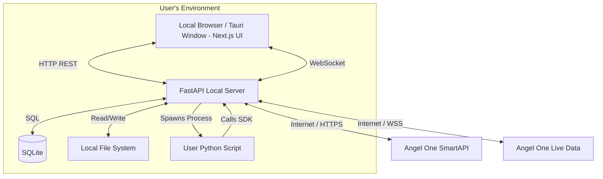

# Architecture & Tech Stack: QuantVision (Local Desktop Deployment)

## 1. Tech Stack Recommendation

Since this application is designed to run natively on the user's local machine, the architecture avoids complex server infrastructure and prioritizes a zero-installation, portable database approach.

*   **Frontend UI:** **Next.js (React) - Static Export.** Next.js will be used to build the rich UI (`react-financial-charts` charting with indicators and drawing tools, Monaco Editor). It will be compiled to a static Single Page Application (SPA).
*   **Core Backend & Execution Engine:** **Python (FastAPI).** Python will act as the local brain of the application. It will serve the Next.js static files, maintain the WebSocket connection to Angel One, and directly execute the user's algorithmic scripts.
*   **Database & Storage:** **SQLite + Local File System.** 
    *   *SQLite:* A lightweight, zero-installation relational database. Used to store user configurations, encrypted API keys, and metadata (like the file paths to saved scripts).
    *   *File System:* User-written Python scripts and raw trade logs will be saved as actual `.py` and `.log` files directly on the user's hard drive (e.g., in a `Documents/QuantVision/` folder). This allows users to easily backup, share, or edit their code using external tools like VS Code.
*   **Desktop Wrapper (Optional):** **Tauri or Electron.** To make it feel like a native desktop app.

## 2. System Architecture (Local Machine)

## 3. Component Breakdown & Simplifications

1.  **Next.js UI (Static):** Handles all user interaction. 
2.  **FastAPI Server:** 
    *   **Market Data Proxy:** Maintains a single WebSocket connection to Angel One and forwards the ticks to the local Next.js frontend.
    *   **Execution Manager:** Spawns a local Python subprocess (`subprocess.Popen`) to run user scripts loaded from the file system.
3.  **Data Storage:** User preferences and encrypted keys are in SQLite. Raw code and logs are on the OS file system.
